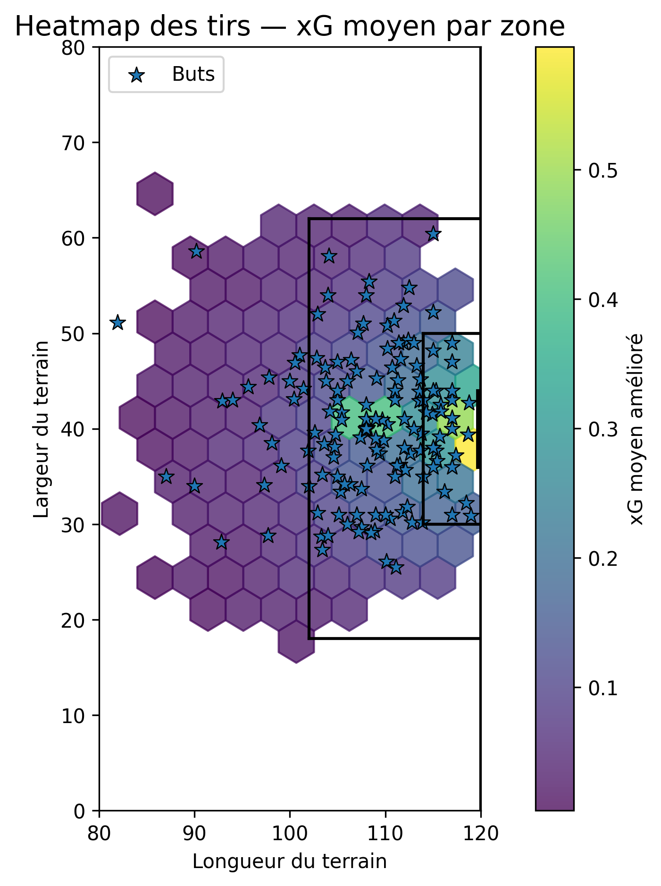

# ⚽ Expected Goals (xG) Model — Football Analytics

Expected Goals (xG) model built using StatsBomb open data.

## 📊 Project Overview

This project aims to model the probability that a shot results in a goal using:

- Distance to goal
- Shot angle
- Body part
- Shot type
- First-time shot indicator

Two models are implemented:
- Baseline model (distance + angle)
- Improved model (additional features)

---

## 📈 Results

| Model | Brier Score | Log Loss | AUC |
|------|------------|----------|-----|
| Baseline | 0.098 | 0.332 | 0.724 |
| Improved | 0.084 | 0.296 | 0.782 |
| Interactions | 0.084 | 0.294 | 0.787 |

The improved model shows better predictive performance, demonstrating the value of contextual features beyond distance and angle.
Adding interaction terms slightly improves the model, suggesting that nonlinear relationships between shot distance, angle and shot context provide additional predictive information.

---

## 📊 Bootstrap validation

A bootstrap procedure with 1000 resamples was used to estimate the stability of the interaction-based model.

| Metric | Mean | 95% Confidence Interval |
|---|---|---|
| Brier Score | 0.084 | [0.073 ; 0.096] |
| Log Loss | 0.294 | [0.265 ; 0.327] |
| AUC | 0.788 | [0.748 ; 0.824] |

The relatively narrow confidence intervals suggest that the model is statistically stable across resampled datasets.

---

## 🔥 Visualization

### Heatmap of expected goals



This heatmap shows average xG per zone on the pitch.

---

## 📂 Data

- Source: StatsBomb Open Data
- Number of matches: 50
- Total shots: 1390
- Total goals: 166

---

## 🚀 Future Work

- Incorporate defensive pressure (StatsBomb 360)
- Explore probabilistic models (Bayesian approaches, mixture models)
- Compare calibration curves with StatsBomb xG
- Add player-level and team-level analysis

  ---
  
## ⚙️ How to run

```bash
python main.py
